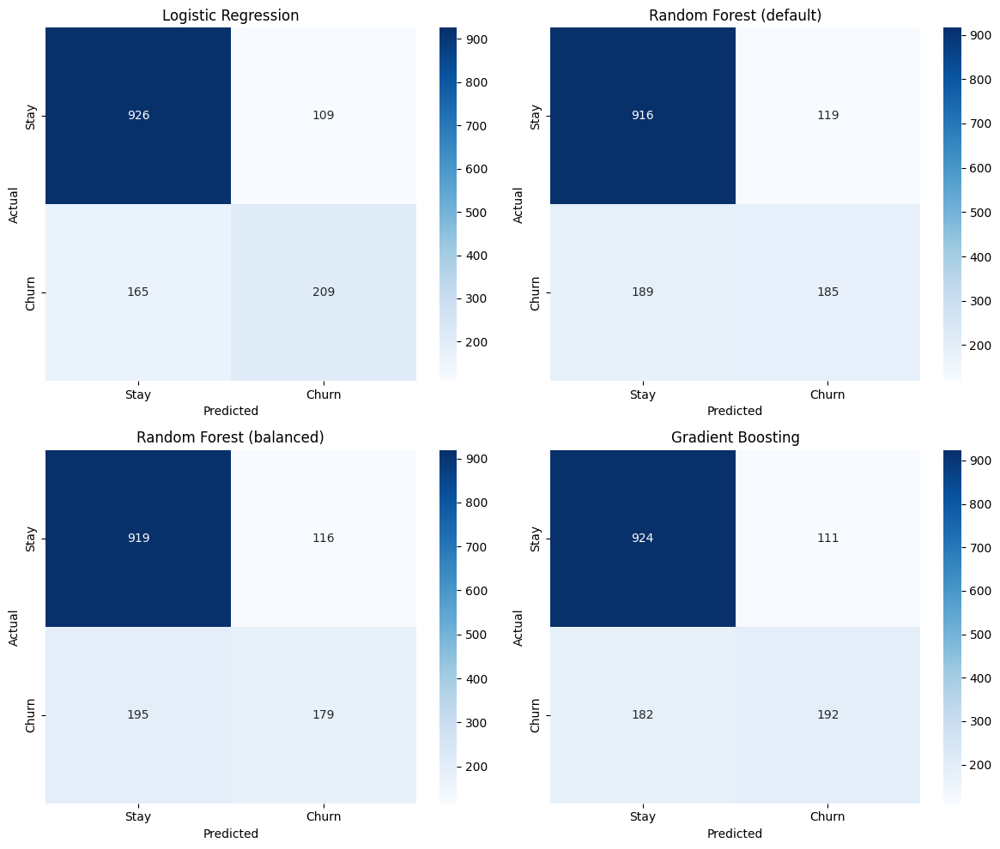
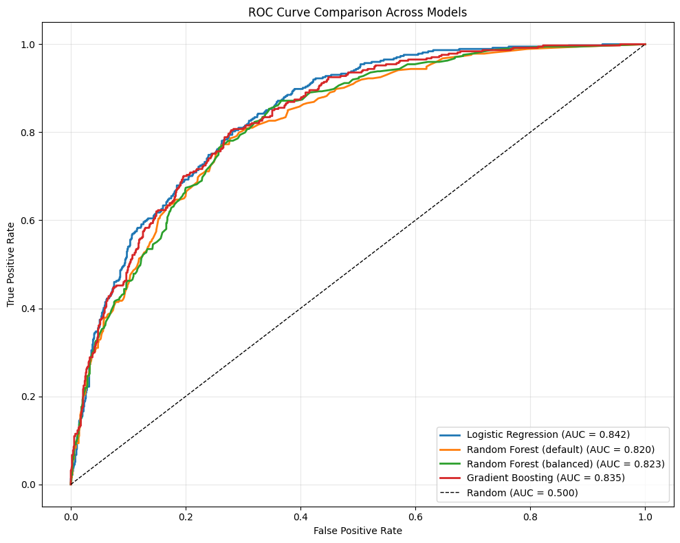

# Telco Customer Churn — Classification Project

A machine learning project predicting which customers will churn for a US-based telco, using **7,043 real customer records**. The goal: identify the strongest churn drivers and recommend a targeting strategy that catches the maximum number of churners with the minimum retention budget.

---

## 🎯 Headline Result

**Logistic Regression — the simplest model — outperformed Random Forest, balanced Random Forest, and Gradient Boosting on this dataset.**

| Model | ROC-AUC | Recall (Churn) | Precision (Churn) | F1 (Churn) |
|---|---|---|---|---|
| **Logistic Regression** ⭐ | **0.8420** | **0.56** | **0.66** | **0.60** |
| Gradient Boosting | 0.8351 | 0.51 | 0.63 | 0.57 |
| Random Forest (balanced) | 0.8232 | 0.48 | 0.61 | 0.54 |
| Random Forest (default) | 0.8196 | 0.49 | 0.61 | 0.55 |

The Telco features (Contract type, tenure, MonthlyCharges) combine mostly *additively* with churn risk — exactly what linear models capture best. Tree ensembles add complexity without finding non-linear interactions that aren't there. **A useful reminder that algorithm sophistication doesn't automatically improve performance.**

### Visual Evaluation

---

## 📊 Business Recommendation: Smart Targeting

The model's real value is enabling **risk-targeted retention** instead of blanket outreach:

| Strategy | Customers contacted | Churners caught | % of all churners | Lift vs random |
|---|---|---|---|---|
| Top 5% riskiest | 70 | 54 | 14.4% | **2.89×** |
| Top 10% riskiest | 140 | 105 | 28.1% | **2.81×** |
| **Top 20% riskiest** | **281** | **186** | **49.7%** | **2.49×** |
| Top 30% riskiest | 422 | 243 | 65.0% | 2.17× |
| Top 50% riskiest | 704 | 326 | 87.2% | 1.74× |

**Recommended deployment:** Target the top 20–30% riskiest customers. Catches half to two-thirds of all churners using a fraction of the retention budget — 2.2× to 2.5× more efficient than random outreach.

---

## 🔍 Where Churn Comes From (Feature Findings)

Based on EDA + Logistic Regression coefficients (validated against Gradient Boosting feature importance):

1. **Contract structure dominates.** Month-to-month customers churn at 42%; two-year contract customers churn at <3%. A 13× difference from a single feature. Incentivizing longer contracts is the clearest single retention lever.

2. **Tenure compounds loyalty.** Newer customers churn dramatically more. The first 12 months are the high-risk window — investing in onboarding has outsized returns.

3. **Fiber optic customers churn more than DSL.** Counterintuitive given fiber is the premium tier. Suggests a service-quality or competitive-pricing issue worth investigating.

4. **Service add-ons act as retention anchors.** Customers without OnlineSecurity or TechSupport churn 3–4× more. Bundling these by default could improve retention.

5. **Electronic check users churn more than auto-pay users.** Likely a friction signal — manual payment creates natural exit moments.

6. **Voucher / paperless billing customers churn slightly more.** Likely a proxy for tech-savvy, price-comparing customer types.

---

## 📂 Project Structure

telco-churn-prediction/
├── notebooks/
│   └── 01_eda_modeling.ipynb     ← full analysis: EDA → preprocessing → 4 models → recommendation
├── data/                          ← Telco CSV (gitignored, see reproduction below)
├── *.png                          ← saved charts referenced in this README
├── .gitignore
└── README.md

## 🛠️ Tech Stack

- **Python 3.12** · pandas · numpy · matplotlib · seaborn · scikit-learn
- **Jupyter Notebook** for interactive analysis
- Workflow: load → EDA → preprocess (impute, encode, scale) → train/test split → train 4 models → evaluate → interpret coefficients → business recommendation

## 🔁 How to Reproduce

1. Clone this repo: `git clone https://github.com/ZakkiShah5/telco-churn-prediction.git`
2. Download the dataset from [Kaggle](https://www.kaggle.com/datasets/blastchar/telco-customer-churn) (single CSV).
3. Place the CSV in a `data/` folder at the project root.
4. Install dependencies: `pip install pandas numpy matplotlib seaborn scikit-learn jupyter`
5. Open `notebooks/01_eda_modeling.ipynb` and run all cells.

---

## 📐 Methodology Notes

- **Dataset:** 7,043 customers, 21 columns, ~26.5% churn rate (imbalanced).
- **Preprocessing:**
  - `TotalCharges` converted from text to numeric; 11 missing values (all `tenure=0` customers) imputed with 0.
  - `customerID` dropped (no predictive value).
  - Binary categoricals mapped 0/1; multi-value categoricals one-hot encoded.
  - Numerical features (`tenure`, `MonthlyCharges`, `TotalCharges`) standardized for LogReg via `StandardScaler` (fit on training only — test data scaled with training-data statistics to prevent leakage).
- **Train/test split:** 80/20 stratified split to preserve churn ratio in both sets.
- **Models compared:** Logistic Regression, Random Forest (default), Random Forest (`class_weight='balanced'`), Gradient Boosting.
- **Evaluation metrics:** ROC-AUC (primary), precision, recall, F1, confusion matrix. ROC-AUC chosen because the data is imbalanced and it's threshold-independent.

---

## ⚠️ Limitations

- **Single time window:** dataset doesn't span multiple years; seasonal effects in cancellation behavior couldn't be confirmed.
- **Multicollinearity:** `tenure` and `TotalCharges` are highly correlated (+0.83); `MonthlyCharges` and `InternetService_Fiber optic` also correlate. LogReg coefficients should be read with care because the model splits attribution across correlated features (e.g., `MonthlyCharges` carries a negative coefficient because the fiber-optic feature absorbs the "high charges → churn" signal).
- **Default 0.5 threshold** yields recall of 0.56 on churners. For deployment, lowering the threshold to ~0.35 trades precision for recall — appropriate when missing a churner is more expensive than wasting a retention offer.
- **"Canceled" status is narrow:** orders coded `unavailable` or never delivered may functionally be cancellations but were excluded.

## 🔭 Future Work

- Threshold tuning experiments (find optimal F1 across 0.1–0.9)
- Cost-sensitive evaluation using estimated retention-offer cost vs customer lifetime value
- Feature engineering: ratio features (`TotalCharges / tenure`), service-count aggregations
- Survival analysis (when do customers churn, not just whether)
- Validation on a holdout time period (rolling-window evaluation)

---

## 👤 About

Built by **Zakee Ul Hassan** as part of a 4-week portfolio sprint transitioning from web development to Data Science. MSc Mathematics candidate at the Federal University of Santa Maria (UFSM), focused on hybrid GLARMA + ML models for count time series forecasting (thesis: respiratory mortality data, Santa Maria, RS).

📫 [LinkedIn](https://www.linkedin.com/in/zakee-ul-hassan-813b201ab/) · zakki5shah@gmail.com

🔗 Other portfolio project: [Olist E-Commerce EDA](https://github.com/ZakkiShah5/olist-ecommerce-eda)